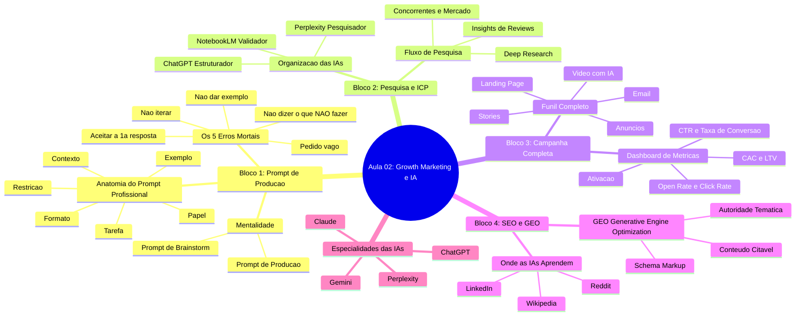

# Mapa Mental: Aula 02 - Growth Marketing & AI

Este documento contém o diagrama em formato Mermaid baseado no mapa mental fornecido, complementado com descrições detalhadas extraídas do material da aula.

## Diagrama (Mermaid)

## Descrições Detalhadas dos Nós

### Bloco 1: Prompt de Produção

* **Anatomia do Prompt Profissional:**
* **Papel:** Define quem a IA deve atuar (ex: copywriter sênior).
* **Contexto:** Descreve o cenário e o público-alvo.
* **Tarefa:** Especifica o que precisa ser entregue.
* **Formato:** Define a estrutura e limites da saída (ex: caracteres, linhas).
* **Restrição:** Instrui explicitamente o que NÃO fazer, evitando clichês.
* **Exemplo:** Fornece um modelo ou referência de estilo desejado.

* **Os 5 Erros Mortais:**
* **Pedido vago:** Deixa a IA chutar o tom e o público por falta de contexto.
* **Aceitar a 1ª resposta:** A primeira saída é média; o ideal é iterar para encontrar a melhor versão.
* **Não dizer o que NÃO fazer:** Resulta em textos cheios de jargões e palavras como "revolucione".
* **Não dar exemplo:** Desperdiça tempo descrevendo o tom quando um exemplo prático resolveria.
* **Não iterar:** Aceitar uma resposta medíocre em vez de pedir refinamentos simples.

* **Mentalidade:** Diferencia o prompt de brainstorm (curto e exploratório) do prompt de produção (longo e estruturado).

### Bloco 2: Pesquisa e ICP (Ideal Customer Profile)

* **Organização das IAs:**
* **ChatGPT (Estruturador):** Define o framework de pesquisa e organiza perguntas.
* **Perplexity (Pesquisador):** Busca dados de concorrentes e do mercado em tempo real, fornecendo fontes.
* **NotebookLM (Validador):** Extrai padrões e citações literais a partir das fontes fornecidas.

* **Fluxo de Pesquisa:**
* Inclui a análise de concorrentes, extração em massa de insights a partir de dezenas de reviews para identificar dores e motivações, e o uso de "Deep Research" para análises mais densas.

### Bloco 3: Campanha Completa (em 50 minutos)

* **Funil Completo:**
* **Anúncios:** Criação de 3 versões de copy (dor, ganho, prova) para Meta/Google Ads.
* **Email:** Estruturação de e-mail de boas-vindas e sequência de "nurturing" (dias 1, 3 e 7).
* **Landing Page:** Criação de texto completo focado em conversão e estrutura de página.
* **Stories:** Sequência provocativa de 5 stories para Instagram.
* **Vídeo com IA:** Geração de vídeos curtos de 8s usando Google Flow.

* **Dashboard de Métricas:**
* Acompanhamento de CTR, Taxa de Conversão, Open/Click Rate, CAC, LTV e taxa de ativação no produto.

### Bloco 4: SEO + GEO (Generative Engine Optimization)

* **GEO:** A nova fronteira da visibilidade focada em ser citado por IAs generativas.
* **Conteúdo Citável:** Uso de frases curtas, listas e dados numéricos que as IAs priorizam.
* **Schema Markup:** Dados estruturados (JSON-LD) para ajudar a IA a ler e classificar conteúdos.
* **Autoridade Temática:** Foco consistente em um único tema para associar a marca à solução.

* **Onde as IAs Aprendem:** Plataformas essenciais para estar presente, como Wikipedia, Reddit e LinkedIn.

### Especialidades das IAs

* **ChatGPT:** Ideal para brainstorm e automação.
* **Claude:** Superior em textos longos, análises profundas e códigos.
* **Gemini:** Forte integração com o Google Workspace e vídeos.
* **Perplexity:** A melhor opção para buscas atuais com citação de fontes em tempo real.